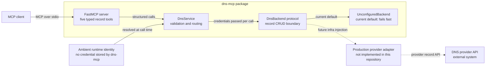

# System context

`dns-mcp` exposes five typed DNS record CRUD tools to an MCP client. The MCP
wrapper delegates validation, normalization, per-call credential resolution,
and backend routing to `DnsService`. Provider-specific behavior is isolated
behind the injected `DnsBackend` protocol.

The current default path reaches `UnconfiguredBackend`, which rejects every DNS
operation until infrastructure supplies a real provider adapter. Tests inject an
in-memory backend and exercise the full service path without provider access or
network I/O.

This diagram is hand-maintained because the repository has no manifest that
describes the MCP, service, and backend relationships. Its sources of truth are
[`mcp_server.py`](../../src/dns_mcp/mcp_server.py),
[`core.py`](../../src/dns_mcp/core.py), and
[`backend.py`](../../src/dns_mcp/backend.py).
